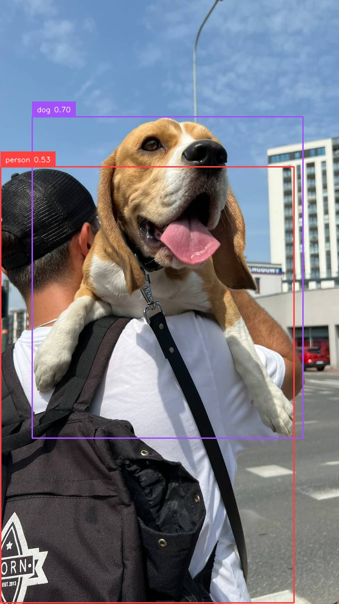

# GroundingDINO Fine-Tune

This repo contains fine-tuned version of GroundingDINO for custom object detection tasks (KITTI).
---
Some Sample Results Without Fine Tuning

### 🖼️ Example 1 Without Fine Tuning

  
  
  
  

  <b>Figure:</b> From left to right (Input Promt) — Dog and Person, Dog Person and Glass, Dog Person and Chair, Dog and Bag.

### 🖼️ Example 2 Fine Tuning on Kitti Dataset

  
  

  <b>Figure:</b> From left to right (Input Promt) — Car, Person.

## Model Info

- Base: GroundingDINO
- Fine Tuned on: KITTI Dataset
- Detection Loss: Hungarian matcher + classification + L1/IoU
- GPU: NVIDIA A100
  

The code is build upon [ECCV 2024 Official implementation of the paper](https://github.com/IDEA-Research/GroundingDINO) "Grounding DINO: Marrying DINO with Grounded Pre-Training for Open-Set Object Detection"
